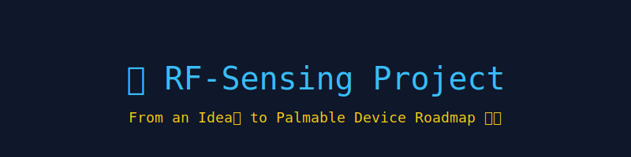

<!-- Banner -->

  

# 📡 RF-Sensing Project Roadmap

  
  
  
  

---

## 🚀 Introduction
Fantastic — I’ll give you a single, **actionable step-by-step roadmap** that takes someone with *no background* to the point where they can build, compress, and prototype a palmable RF → pose device (the evolved “DensePose-from-RF” appliance we’ve been discussing). I’ll keep it practical, low-cost/zero-budget friendly, and split into short learning sprints + concrete projects and deliverables. Follow it in order; treat each small project as a checkpoint.

---

## 📑 Table of Contents
- [Quick map](#-quick-map-what-youll-end-up-able-to-do)
- [Phase structure](#-phase-structure-high-level)
- [24-week step-by-step plan](#-24-week-step-by-step-plan-follow-sequentially-each-week--focused-study--lab)
  - [Weeks 0](#weeks-0-orientation--37-days)
  - [Weeks 1–3](#weeks-13-foundations-math--programming)
  - [Weeks 4–6](#weeks-46-signal-processing-for-rf-sensing)
  - [Weeks 7–9](#weeks-79-rf-fundamentals--wi-fi-internals)
  - [Weeks 10–12](#weeks-1012-intro-to-deep-learning--computer-vision)
  - [Weeks 13–15](#weeks-1315-rf--ml-preprocessing--baseline-student)
  - [Weeks 16–18](#weeks-1618-model-improvements--multi-teacher-supervision)
  - [Weeks 19–20](#weeks-1920-edge-optimization-quantization--pruning)
  - [Weeks 21–24](#weeks-2124-hardware-prototyping--integrated-demos)
  - [Weeks 25–30](#weeks-2530-miniaturization-planning--first-custom-pcb)
  - [Weeks 31+](#weeks-31-polish-privacy-certification-planning)
- [Hands-on project checkpoints](#-hands-on-project-checkpoints-what-you-must-produce)
- [Low-cost hardware options](#-low-cost--zero-budget-hardware-options-start-here)
- [Practical tips & pitfalls](#-practical-tips--common-pitfalls)
- [Evaluation metrics](#-evaluation-metrics-you-should-track)
- [Learning resources](#-free--high-value-learning-resources-what-to-search)

---

## 🗺 Quick map (what you’ll end up able to do)
1. Understand math, signals, and RF basics needed to reason about wireless sensing.  
2. Capture and preprocess wireless measurements (CSI / IQ / radar).  
3. Train ML models (teacher from vision, student on RF) and evaluate them.  
4. Compress and run models on cheap edge hardware.  
5. Build a bench prototype and iterate toward a pocket form factor.  

---

## 🧩 Phase structure (high level)
* Phase A — Foundations (math, programming, Linux, Git).  
* Phase B — Signal processing & RF fundamentals (OFDM, MIMO, CSI concept).  
* Phase C — Computer vision & deep learning fundamentals (teacher models).  
* Phase D — RF → ML integration (feature engineering, translation nets, distillation).  
* Phase E — Edge deployment & hardware prototyping (compression, Coral/Movidius/Jetson, ESP32 / NICs / radar modules).  
* Phase F — Miniaturization & production basics (PCB, antennas, power, regs & privacy).  

Below I give a **week-by-week** learning plan, plus per-week exercises, deliverables, cheap hardware options, evaluation checkpoints, and a “what to do right now” starter list.

---

## 📆 24-week step-by-step plan (follow sequentially; each week ≈ focused study + lab)

### Weeks 0 (Orientation — 3–7 days)
Goal: toolchain + motivation  
- Tasks:  
  * Create GitHub account and a repo `rf-pose-project`.  
  * Install Python 3.10+, Git, VS Code, and sign up for Google Colab.  
  * Learn basic Linux terminal, `ssh`, `scp`, and `git` commands.  
- Deliverable: empty repo with README and a `notebooks/` folder.  
- Why: reproducible workflow and free compute (Colab).  

---

### Weeks 1–3 (Foundations: math & programming)
Goal: read/write code, understand complex numbers, FFT, linear algebra basics.  
- Study:  
  * Python (functions, classes, pip, venv), NumPy, Matplotlib.  
  * Complex numbers & phasors, basic linear algebra (vectors, matrices), basic probability.  
  * FFT and time–frequency basics, windowing.  
- Labs:  
  * Implement complex sinusoid generator and plot its FFT in Python.  
  * Build a simple OFDM transmitter/receiver simulator (IQ samples → FFT → subcarriers → IFFT → add multipath impulse response → recover).  
- Deliverable: Jupyter notebook `week01-03-foundations.ipynb` with FFT & toy OFDM sim.  
- Checkpoint: Can you generate a simulated multipath signal and visualize subcarriers?  

---

### Weeks 4–6 (Signal processing for RF sensing)
Goal: practical DSP used in wireless sensing.  
- Study:  
  * Linear systems, convolution, sampling, aliasing, filters.  
  * Windowed STFT, spectrograms, short-time energy, cross-correlation.  
  * Introduction to IQ samples, amplitude & phase, unwrapping.  
- Labs:  
  * Add AWGN and multipath to OFDM sim; implement phase unwrap and visualize phase distortions.  
  * Write simple denoising filters (median, moving-average) and compare performance.  
- Deliverable: `week04-06-dsp.ipynb` with plots and denoising functions.  
- Checkpoint: Can you denoise phase and unwrap it correctly on noisy sim data?  

---

### Weeks 7–9 (RF fundamentals & Wi-Fi internals)
Goal: understand propagation, antennas, MIMO, OFDM in Wi-Fi, and what CSI is.  
- Study:  
  * Basic EM intuition (waves, wavelength, penetration), multipath and fading (small/large scale).  
  * Antennas (gain, pattern), MIMO concept, channel matrix H.  
  * OFDM subcarriers and how 802.11 uses them; what Channel State Information (CSI) represents.  
- Labs:  
  * Use a public CSI dataset (or simulated CSI from your OFDM sim) to visualize amplitude/phase across subcarriers and time.  
  * If you have an old laptop or Wi-Fi card, explore community CSI extraction tools (later we’ll give low-cost options).  
- Deliverable: `week07-09-rf-intro.ipynb` summarizing CSI plots and observations.  
- Checkpoint: Explain (in README) why phase is noisy in CSI and list two preprocessing steps to stabilize it.  

---

### Weeks 10–12 (Intro to Deep Learning & Computer Vision)
Goal: basics of training neural nets and running pretrained vision models.  
- Study:  
  * PyTorch basics: tensors, dataloaders, training loop, optimizers, loss functions.  
  * CNN fundamentals (conv, stride, receptive field), transfer learning basics.  
  * Object detection/segmentation basics and the idea of a “teacher” model that labels video frames.  
- Labs:  
  * Run a pretrained image classifier; fine-tune a small network on CIFAR-10 (or any small dataset).  
  * Install Detectron2 and run a pretrained segmentation/DensePose model on a short video (on Colab/GPU).  
- Deliverable: `week10-12-dl-cv.ipynb` with fine-tuning logs + script to extract teacher labels from a short video.  
- Checkpoint: You can run a teacher model on one minute of video and save per-frame pseudo-labels (segmentation masks, keypoint heatmaps).  

---

### Weeks 13–15 (RF → ML: preprocessing & baseline student)
Goal: build the first student model that maps RF features to simple labels.  
- Study:  
  * Phase sanitization methods (unwrap, detrend, remove linear phase ramp), amplitude normalization.  
  * Temporal models (1D convs, simple RNNs) for sequences.  
- Labs:  
  * Using pre-extracted CSI + teacher labels, build a small 1D CNN that inputs a short time window of CSI (T × subcarriers × RX/Tx) and outputs: presence / coarse mask / keypoint heatmap.  
  * Train with L1/L2 loss against teacher outputs; measure accuracy vs. baseline.  
- Deliverable: `student_baseline/` with model code, training logs, and evaluation script.  
- Checkpoint: Student gets nontrivial alignment with teacher on held-out room; report IoU or simple mask score.  

---

### Weeks 16–18 (Model improvements & multi-teacher supervision)
Goal: improve accuracy and robustness.  
- Study:  
  * Distillation and feature matching losses, temporal-supervision and smoothness losses, multi-task loss weighting.  
  * Data augmentation for RF (subcarrier dropout, amplitude scaling, time-warp).  
- Labs:  
  * Add a temporal encoder + decoder architecture (1D conv temporal encoder → 2D pseudo-image reconstruction → segmentation head).  
  * Use additional teacher signals (keypoints + segmentation + depth proxies) and combine losses.  
  * Try simple domain adaptation: train with adversarial feature alignment (optional).  
- Deliverable: improved-student model, ablation notebook showing what improves performance.  
- Checkpoint: Show improved IoU / PCK compared to baseline and test across 2 different room layouts.  

---

### Weeks 19–20 (Edge optimization: quantization & pruning)
Goal: make the model small & fast enough to run on cheap edge hardware.  
- Study:  
  * Model compression concepts: pruning, quantization (post-train Q + QAT), knowledge distillation (teacher→student), latency vs. accuracy tradeoffs.  
  * Edge runtimes: TFLite, ONNX, vendor delegates (Edge TPU, TensorRT).  
- Labs:  
  * Convert student model to TFLite; run post-training quantization; measure accuracy drop.  
  * If you have an Edge TPU (Coral USB) or Intel NCS2, test inference locally.  
- Deliverable: quantized model that runs on a small NPU candidate; logs with FPS & memory use.  
- Checkpoint: Achieve acceptable accuracy at ~8-bit quantization and measure inference time on your target device.  

---

### Weeks 21–24 (Hardware prototyping & integrated demos)
Goal: build a bench/portable prototype and iterate.  
- Choose a prototyping path (pick one):  
  * Low-cost / zero-fund path: **ESP32** pair experiments for gesture/presence (learn capture and pipeline).  
  * Mid-cost prototyping: **Raspberry Pi 4 + Intel/AX Wi-Fi NIC with CSI extraction** OR **Jetson Nano + mmWave radar eval board** for better spatial cues. Add Coral USB for acceleration.  
- Tasks:  
  * Build data collection app: capture synchronized RF data + video (phone) for teacher labels. Use audible clap / LED flash for initial sync, then refine by cross-correlation.  
  * Run end-to-end: live RF capture → preprocessing → student inference → visualize mask/keypoints overlay.  
- Deliverable: a recorded demo video showing real-time student predictions on bench hardware; code to reproduce capture → inference pipeline.  
- Checkpoint: Demo runs on bench device at usable framerate (e.g., 5–15 FPS) and shows meaningful silhouettes/keypoints.  

---

### Weeks 25–30 (Miniaturization planning + first custom PCB)
Goal: plan and start a small custom prototype towards pocketability.  
- Tasks:  
  * Finalize sensor choice (compact radar IC vs. Wi-Fi CSI front-end). For highest compactness & better spatial resolution, consider a small FMCW mmWave radar module in addition to Wi-Fi. If budget zero: optimize for Wi-Fi-only with small SBC and antenna.  
  * Create a block-level schematic: RF front end, MCU/SoC, NPU (or USB accelerator), battery/power circuit, IMU, connectors.  
  * 3D-print enclosure prototypes; iterate antenna placement.  
- Deliverable: PCB CAD files (KiCad), basic BOM for a 1–2 unit prototype, and a pocketable enclosure design.  
- Checkpoint: Build & test the custom PCB (or a minimal breakout) and run the inference pipeline.  

---

### Weeks 31+ (Polish, privacy, certification planning)
Goal: ready the device for sharing / small pre-production.  
- Tasks:  
  * Aggressively test across rooms, people, clothing, furniture configurations. Log failure modes.  
  * Add privacy protections: on-device-only inference, data deletion UI, clear consent flow.  
  * Plan certification (FCC/CE) research — if using active radar or custom transmitters, plan for regulatory compliance.  
- Deliverable: full project documentation (README, data schema, training scripts, deployment instructions, privacy policy).  

---

## 🛠 Hands-on project checkpoints (what you must produce)
1. Toy OFDM & CSI simulator (Week 1–6).  
2. Teacher label extraction script from video (Week 10–12).  
3. Student baseline trained on CSI + teacher labels (Week 13–15).  
4. Improved student with temporal + multi-teacher supervision (Week 16–18).  
5. Quantized model running on an edge device (Week 19–20).  
6. Bench prototype demo (Week 21–24).  
7. Custom PCB + pocket enclosure plan (Week 25–30).  

---

## 💸 Low-cost / zero-budget hardware options (start here)
- **Free / zero-fund**: Use public CSI datasets and Colab GPU for model work; use your smartphone for video teacher labels.  
- **Very cheap (~$30–$100)**: 2 × ESP32 boards for ultra-basic experiments (gesture/presence).  
- **Affordable (~$50–$250)**: used laptop Wi-Fi NICs (Intel 5300/AX210) + a cheap mini-PC or Raspberry Pi — community CSI tools exist. Add USB Coral (~$75) if you need acceleration.  
- **Better prototyping (~$200–$800)**: Jetson Nano/Orin Nano dev kit + small mmWave radar eval board (TI family) or an AX210 card in a Linux host for higher-quality CSI.  

---

## ⚠️ Practical tips & common pitfalls
- **Phase = fragile**: Always implement phase sanitization early — unwrapped, detrended phase is crucial.  
- **Syncing video & RF**: Start with claps/LED pulses for rough sync, then refine by correlating movement spikes.  
- **Overfitting**: RF data is highly environment–specific; test in multiple rooms and with many people/clothing configs.  
- **Privacy**: Process video locally when creating teacher labels; delete raw video once labels extracted if you want to be privacy-first.  
- **Compute**: Don’t try to train huge models on Colab forever — use small models and distillation for edge viability.  

---

## 📊 Evaluation metrics you should track
- For masks: **IoU**, mean IoU across frames.  
- For keypoints: **PCK** (percentage within threshold), MPJPE if 3D joints available.  
- Latency: end-to-end inference time (ms).  
- Power: current draw (mA) at target battery voltage.  
- Robustness: performance across rooms, device orientations, and persons (present results on at least 3 rooms / 5 people).  

---

## 📚 Free & high-value learning resources (what to search)
- Python & NumPy/PyTorch official tutorials.  
- DSP: short courses or chapters on FFT, sampling, filters.  
- RF wireless intro: “multipath, fading, MIMO” lectures (university open courseware).  
- Deep learning: Fast.ai practical course (hands-on), PyTorch tutorials.  
- Detectron2 & DensePose model zoo (to get teacher outputs).  
- Community CSI repos / papers (to learn capture & preprocessing).  

---

✨ *This roadmap is a complete guide to becoming proficient in RF sensing, deep learning, and edge deployment — culminating in building a palmable RF-Sensing device.*  
